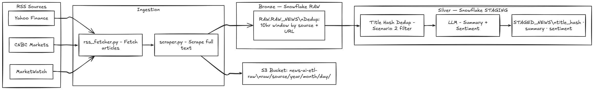
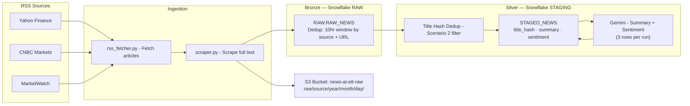

# news-ai-etl

An AI-powered ELT pipeline that fetches financial news from RSS feeds, scrapes full article text, deduplicates across sources, and uses an LLM to generate summaries and sentiment analysis — all stored in Snowflake and orchestrated with Airflow.

---

## Architecture





---

## Project Structure

```
news-ai-etl/
├── ingestion/
│   ├── config.py           # RSS feed URLs
│   ├── rss_fetcher.py      # Fetch and parse RSS feeds
│   └── scraper.py          # Scrape full article text from URLs
├── storage/
│   ├── s3_storage.py       # Save raw JSON to S3 (date-partitioned)
│   ├── snowflake_loader.py # Load raw articles into Snowflake bronze
│   ├── silver_loader.py    # Dedup by title hash, load into silver
│   └── llm_enricher.py     # Gemini summary + sentiment, written back to silver
├── snowflake_queries/
│   ├── setup.sql           # Bronze layer DDL (RAW schema + RAW_NEWS table)
│   └── staging_setup.sql   # Silver layer DDL (STAGING schema + STAGED_NEWS table + LLM columns)
├── dags/
│   └── news_ai_etl_dag.py  # Same 6 steps as run.py, split into Airflow tasks
├── docs/
│   └── architecture.md     # Full architecture diagram
├── run.py                  # Main pipeline entry point (local/manual run, uses .env)
├── requirements.txt
├── requirements-airflow.txt # Extra provider packages needed only by the DAG
└── .env                    # Local credentials (never committed)
```

---

## Data Flow

| Step | What happens |
|------|-------------|
| 1 — Fetch | Poll 3 RSS feeds, parse each article (title, link, published, description) |
| 2 — Scrape | Visit each article URL, extract full body text using BeautifulSoup |
| 3 — S3 | Save raw JSON to `s3://news-ai-etl-raw/raw/{source}/year=/month=/day=/` |
| 4 — Bronze | Insert into `RAW.RAW_NEWS` — skip if same source+URL seen in last 10 hrs |
| 5 — Silver | Deduplicate by title hash (same story across feeds), save to `STAGING.STAGED_NEWS` |
| 6 — Enrich | Pull up to 3 unprocessed rows from `STAGING.STAGED_NEWS`, send article text to Gemini for a summary + sentiment, write results back to the same row |

---

## Deduplication Strategy

**Scenario 1 — Same article, same feed (repeat fetch)**
- Checked at bronze insert time
- Query `RAW.RAW_NEWS` for matching `source + link` within the last 10 hours
- If exists → skip insert

**Scenario 2 — Same story, different feed**
- Checked at silver insert time
- Normalize title → lowercase + strip → MD5 hash
- If hash already in `STAGED_NEWS` → skip LLM + insert

---

## Snowflake Schema

**Bronze — `RAW.RAW_NEWS`**

| Column | Type | Description |
|--------|------|-------------|
| source | VARCHAR | Feed name (yahoo_finance, cnbc_markets, marketwatch) |
| title | VARCHAR | Article headline |
| link | VARCHAR | Article URL |
| published | VARCHAR | Published date from RSS |
| description | TEXT | Opening lines from RSS feed |
| text | TEXT | Full scraped article body |
| fetched_at | VARCHAR | Timestamp when fetched |

**Silver — `STAGING.STAGED_NEWS`**

| Column | Type | Description |
|--------|------|-------------|
| title_hash | VARCHAR | MD5 of normalized title (dedup key) |
| source | VARCHAR | First source that had this story |
| title | VARCHAR | Article headline |
| link | VARCHAR | Article URL |
| published | VARCHAR | Published date |
| description | TEXT | Opening lines |
| text | TEXT | Full article body |
| fetched_at | VARCHAR | When fetched |
| staged_at | VARCHAR | When moved to silver |
| summary | TEXT | Gemini-generated 2-3 sentence summary |
| sentiment | VARCHAR | `positive` / `negative` / `neutral` |
| enriched_at | VARCHAR | When the LLM enrichment step ran |

**Enrichment note:** each run only processes up to **3** rows where `summary IS NULL`
(newest first) to keep Gemini token usage low — later runs pick up the rest.

---

## Setup

**1 — Clone and create virtual environment**
```bash
git clone https://github.com/ayanhussain81/news-ai-etl.git
cd news-ai-etl
python -m venv venv
venv\Scripts\activate
pip install -r requirements.txt
```

**2 — Create `.env` file**
```
SNOWFLAKE_PASSWORD=your_password_here
GEMINI_API_KEY=your_gemini_api_key_here
```
Get a free Gemini API key from [Google AI Studio](https://aistudio.google.com/apikey).

**3 — Set up Snowflake**

Run in Snowsight (in order):
```
snowflake_queries/setup.sql
snowflake_queries/staging_setup.sql
```

**4 — Run the pipeline**
```bash
python run.py
```

---

## Airflow Setup

`dags/news_ai_etl_dag.py` runs the same 6 steps as `run.py`, but as separate
Airflow tasks (`fetch_rss` → `scrape_articles` → `save_to_s3` → `load_bronze`
→ `load_silver` → `enrich_with_llm`). It does **not** read `.env` — credentials
come from Airflow's own Connections and Variables instead, so secrets live in
one place regardless of who/what triggers a run.

**1 — Install the extra provider packages** into your Airflow environment
(wherever `airflow` itself is installed — this is separate from the local
`venv` used for `run.py`):
```bash
pip install -r requirements-airflow.txt
```

**2 — Point Airflow at this repo's `dags/` folder**, and make sure the
`ingestion/` and `storage/` packages are importable from it — either run
Airflow with this project root as the working directory, or set:
```bash
export PYTHONPATH="/path/to/news-ai-etl:$PYTHONPATH"
```

**3 — Create the S3 connection** (Airflow UI → Admin → Connections → +):
| Field | Value |
|---|---|
| Connection Id | `aws_default` |
| Connection Type | Amazon Web Services |
| AWS Access Key ID | your key |
| AWS Secret Access Key | your secret |
| Extra | `{"region_name": "us-east-1"}` |

**4 — Create the Snowflake connection** (Admin → Connections → +):
| Field | Value |
|---|---|
| Connection Id | `snowflake_default` |
| Connection Type | Snowflake |
| Login | `AYANHUSSAIN` |
| Password | your Snowflake password |
| Account | `XBYCFDM-CO68158` |
| Warehouse | `NEWS_WH` |
| Database | `NEWS_AI_ETL` |
| Schema | `RAW` |
| Role | `ACCOUNTADMIN` |

**5 — Create the Gemini API key variable** (Admin → Variables → +):
| Key | Value |
|---|---|
| `gemini_api_key` | your Gemini API key from [Google AI Studio](https://aistudio.google.com/apikey) |

Both the password and the API key are sensitive — Airflow automatically masks
any Connection/Variable whose name contains `password`, `key`, `secret`, etc.
in the UI and logs, so no extra config is needed for that.

**Note on task granularity:** `scrape_articles` and `save_to_s3` pass the full
article dict (including scraped body text) between tasks via XCom. That's
fine at this project's volume (~3 feeds, a few dozen articles per run), but
XCom isn't meant for large payloads — if this ever scales up, switch those
tasks to read/write through S3 or Snowflake directly instead of passing data
through XCom.

---

## Branches

| Branch | Purpose |
|--------|---------|
| `feature/local-ingestion` | RSS fetch + scraper + S3 + Snowflake bronze |
| `feature/dedup` | + 10hr bronze dedup + title hash silver dedup |
| `feature/airflow-dags` | + Gemini enrichment (summary + sentiment) + Airflow DAG conversion |

---

## Tech Stack

- **Python** — ingestion, scraping, orchestration
- **feedparser** — RSS parsing
- **BeautifulSoup** — article text scraping
- **boto3** — S3 upload
- **snowflake-connector-python** — Snowflake integration
- **AWS S3** — raw data lake storage
- **Snowflake** — bronze + silver data warehouse
- **Google Gemini** (free tier) — summary and sentiment analysis
- **Apache Airflow** — scheduling and task orchestration (`dags/news_ai_etl_dag.py`)
