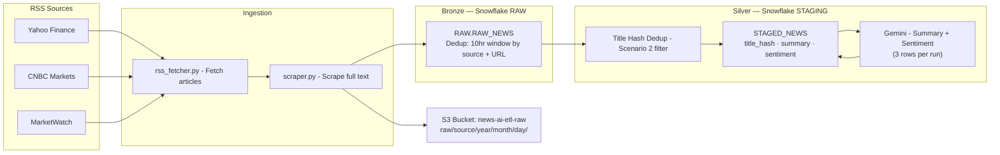

# News AI ETL — Architecture Diagram

## Orchestration

`dags/news_ai_etl_dag.py` runs this same flow as six Airflow tasks
(`fetch_rss` → `scrape_articles` → `save_to_s3` → `load_bronze` →
`load_silver` → `enrich_with_llm`), scheduled every 6 hours. Credentials
come from Airflow Connections (`aws_default`, `snowflake_default`) and an
Airflow Variable (`gemini_api_key`) rather than `.env` — see the
"Airflow Setup" section in the main [README](../README.md) for exact steps.
